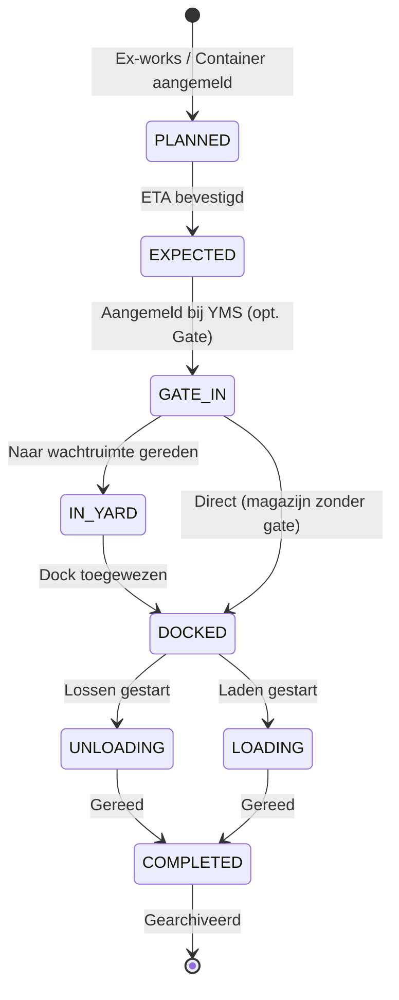

# ARCHITECTURE: ILG Foodgroup Control Tower
*Versie: v3.6.0 — Bijgewerkt: 2026-03-26 door @System-Architect*

> [!NOTE]
> Bijgewerkt na v3.6.0 release: Dashboard Navigatie, Transport Mail, Pipeline Toggle en Logboek.

Dit document beschrijft de technische blauwdruk van het ILG Foodgroup YMS, ontworpen voor maximale schaalbaarheid, data-integriteit en een superieure gebruikerservaring.

## 1. Atomic Design & Mappenstructuur

We hanteren een **Atomic Design** methodiek voor maximale herbruikbaarheid en logische isolatie:

| Laag | Pad | Inhoud |
|---|---|---|
| Atoms & Molecules | `/src/components/shared` | Button, Modal, Badge, Card — volledig context-vrij |
| Organisms | `/src/components/features` | YmsTimeline, DockGrid, DeliveryTable — bevatten bedrijfslogica |
| Templates & Pages | `/src/components/` | YmsDashboard, Settings — brengen features samen |
| Hooks | `/src/hooks/` | `useYmsData`, `useDeliveries` — isoleren state-access |

## 2. Logistieke State Machine

De levenscyclus van een vracht is strikt gedefinieerd om data-inconsistenties te voorkomen:



## 3. Uni-directionele Dataflow (Kern-Architectuur)

Het systeem hanteert een strikte uni-directionele dataflow om race-conditions en stale state te vermijden:

```
[Gebruiker] → [UI Action] → [SocketContext.dispatch()]
    → [socket.emit('action', {type, payload})]
    → [Server: socketHandlers.ts — try/catch per case]
    → [Database: queries.ts — INSERT OR REPLACE]
    → [buildStaticState(warehouseId)]
    → [io.sockets.forEach → s.emit('state_update', ...)]
    → [SocketContext setState()] → [React re-render]
```

**Kritische bevindingen & v3.6.0 Feature Architecture:**
- **Navigation Flow**: Het dashboard gebruikt `onNavigate` met een `initialSelectedId` om direct de detail-modal in de `DeliveryManager` te triggeren via een `useEffect` hook.
- **Mail Integration**: De `TransportMailModal` genereert client-side `mailto:` links op basis van dynamische transporteur-data, waardoor geen backend SMTP-relay nodig is voor de eerste versie.
- **State Merging (v3.5.4)**: `socketHandlers.ts` implementeert nu server-side merging van payloads om `NOT NULL` constraint violations bij partiële updates te voorkomen.
- **Queue Management**: De wachtrij gebruikt een prioriteitsalgoritme (Reefer first) en live wachttijd-calculatie.

## 4. Database Architectuur (SQLite via better-sqlite3)

### Tabelstructuur — Kern (Global Pipeline)
```
users          (id PK, name, email, passwordHash, role, permissions JSON)
deliveries     (id PK, type, reference, billOfLading, supplierId, status, eta, ...)
documents      (id PK, deliveryId FK, name, status, required)
address_book   (id PK, type, name, contact, email, ...)
logs           (id PK, timestamp, user, action, details)
audit_logs     (id PK, deliveryId FK, timestamp, user, action, details)
settings       (key PK, value JSON)
```

### Tabelstructuur — YMS-kern
```
yms_warehouses (id PK, name, hasGate)
yms_docks      (id, warehouseId — composite PK)
yms_waiting_areas (id, warehouseId — composite PK)
yms_deliveries (id PK, warehouseId, dockId, status, scheduledTime, ...)
```

## 5. Audit Trail & Logboek (v3.6.0)
Elke wijziging aan een levering wordt vastgelegd in de `audit_logs` tabel. In de **Archief** module wordt deze data via de `AuditLogModal` gevisualiseerd in een chronologische tijdlijn (wie, wat, wanneer), wat essentieel is voor post-operationele analyse en compliance.

## 6. Multi-Warehouse State Isolatie
Elk socket-verbinding draagt een `socket.data.selectedWarehouseId`. Bij elke `buildStaticState`-aanroep wordt `getYmsDeliveries(warehouseId)` en `getYmsDocks(warehouseId)` doorgegeven zodat elke gebruiker alleen de data van zijn eigen magazijn ziet.

## 7. Kwaliteitsbewaking (Automated Validation Suite)

Sinds v3.5.1 hanteert het platform een volledig geautomatiseerde validatie-suite:

| Laag | Tool | Scope |
|---|---|---|
| **E2E Testing** | Playwright | Kritieke user-flows zoals de Priority Queue en Dashboard Navigatie. |
| **Integration** | Vitest | Uni-directionele dataflow validatie (Action → Socket → DB). |
| **Integrity** | tsx script | Database health checks (`db-health.ts`) op inconsistenties. |

## 8. Release Criteria (v3.6.0)
- ✅ `npm run test:full` slaagt 100%
- ✅ Bill of Lading (B/L) is zichtbaar in alle views (Dashboard, Pipeline, Archive)
- ✅ Pipeline View Toggle (Grid/List) werkt vloeiend zonder re-fetch
- ✅ Archive Logboek toont correcte audit trail data
- ✅ Directe navigatie vanaf Dashboard opent correcte detail-modal
- ✅ Sonner-toasts voor alle backend-fouten
- ✅ Z-index: toasts > modals > sidebar
