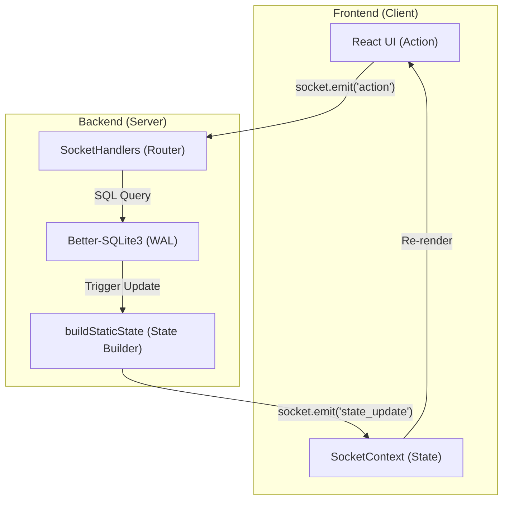
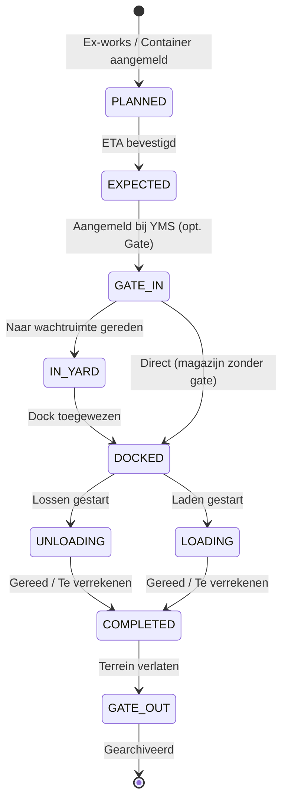

# ARCHITECTURE: ILG Foodgroup Control Tower
*Versie: v3.14.0 — Bijgewerkt: 2026-04-08 door @System-Architect*

> [!IMPORTANT]
> Dit bestand is onderdeel van de automatische versie-synchronisatie. Voer na elke wijziging in dit bestand verplicht `npm run version:sync` uit om project-brede consistentie te borgen.

> [!NOTE]
> Bijgewerkt na v3.10.2 UI & Navigation Refactor: Direct Dashboard Editing, Shared Modal Pattern en Gecentraliseerde Capaciteitsinstellingen.

Dit document beschrijft de technische blauwdruk van het ILG Foodgroup YMS, ontworpen voor maximale schaalbaarheid, data-integriteit en een superieure gebruikerservaring.

## 1. Mappenstructuur (Folder Tree)

We hanteren een strikte scheiding tussen de frontend (React) en backend (Node.js/Socket.io). De frontend volgt de **Atomic Design** principes.

```text
.
├── server/                 # Backend (Node.js, Express, Socket.io)
│   ├── db/                 # Database logica & SQLite opslag
│   │   ├── migrations/     # SQL- en TS-migratiebestanden (v3.10.x compliant)
│   │   ├── database.db     # Lokale ontwikkelingsdatabase
│   │   └── migrator.ts     # Handelt de uitvoering van migraties af
│   ├── middleware/         # Express middleware (bv. auth.ts voor JWT)
│   ├── routes/             # REST API endpoints (auth.ts, deliveries.ts)
│   ├── scripts/            # Backend onderhoud scripts (db-health, sync-version)
│   ├── services/           # Business logic (pdfService, queueService)
│   ├── sockets/            # socketHandlers.ts (Centrale real-time router)
│   └── workers/            # Achtergrondtaken (bv. inventory-worker)
├── src/                    # Frontend (React 19, Vite)
│   ├── components/
│   │   ├── features/       # Business-specifieke componenten (o.a. Timeline, PalletLedger)
│   │   ├── shared/         # Herbruikbare Atomic componenten (Button, Modal, Table)
│   │   ├── ui/             # UI-hulpcomponenten (Combobox, MilestoneStepper)
│   │   ├── AddressBook.tsx # Adresboek beheer
│   │   ├── Dashboard.tsx   # Hoofddashboard view
│   │   ├── YmsDashboard.tsx# Operationele Yard view
│   │   └── ...             # Overige (UserManagement, Settings, Statistics)
│   ├── db/                 # Client-side DB toegang (sqlite.ts, queries.ts)
│   ├── hooks/              # Custom React hooks (useDeliveries, useYmsData)
│   ├── lib/                # Utility functies en validatieregels (logistics.ts, ymsRules.ts)
│   ├── services/           # Interne frontend services
│   ├── test/               # Frontend test setup
│   ├── types.ts            # Centrale TypeScript-interfaces
│   ├── SocketContext.tsx   # Context voor real-time socket communicatie
│   ├── ThemeContext.tsx    # Context voor Dark/Light/ILG thema's
│   └── main.tsx            # App entry point
├── tests/                  # Test Suite (Playwright & Vitest)
│   ├── e2e/                # End-to-end tests (o.a. dock_occupancy, finance, rbac)
│   └── integration/        # Integratietesten voor auth en sockets
├── scripts/                # Root-level scripts (reset_db, seed_demo)
├── public/                 # Statische assets (logo's, achtergronden)
├── database.sqlite         # Hoofd SQLite database bestand
├── server.ts               # Backend Entry point
└── AGENTS.md, ARCHITECTURE.md, ROADMAPv3.md # Kern documentatie
```

## 2. Systeem Blauwdruk (Dataflow)

Het systeem werkt op basis van een real-time, event-gedreven architectuur.



## 3. State Synchronization (Upsert Pattern)
Sinds v3.9.1 hanteert de `SocketContext` een **Upsert-patroon** voor real-time updates:
1. **`state_update`**: Volledige reconciliatie van de warehouse-state bij verbinding of selectie.
2. **`state_patch`**: Delta-updates voor bestaande records.
3. **state_upsert**: Indien een patch een onbekend ID bevat (bijv. een nieuwe test-levering), wordt deze direct toegevoegd aan de lokale cache. Dit voorkomt 'ghost data' tijdens snelle E2E-sequenties.
4. **Feature Flags**: Sinds v3.12.0 ondersteunt de state `featureFlags` in `settings`. De vlag `enableFinance` regelt de zichtbaarheid van het pallet-grootboek en financiële kostenvelden in de UI.

## 4. Logistieke Levenscyclus (State Machine)

De levenscyclus van een vracht is cruciaal voor de **Smart Call Logic** en dashboard-filtering:



## 4. Uni-directionele Dataflow (Kern-Architectuur)

Het systeem hanteert een strikte flow om race-conditions te vermijden:

1.  **UI Action**: Gebruiker klikt op een knop (bijv. "Lossen").
2.  **Socket Emit**: De client stuurt een event naar de server met de API-token.
3.  **Server Validatie**: De server valideert de rechten en de huidige status.
4.  **Database Write**: De wijziging wordt persistent gemaakt in SQLite (WAL mode).
5.  **State Broadcast**: De server bouwt de *nieuwe statische state* op en verstuurt deze naar alle aangesloten clients in dat magazijn.
6.  **React Sync**: De client update zijn lokale cache en triggert een re-render.

## 5. Database Architectuur (SQLite via better-sqlite3)

### Tabelstructuur — Kern (v3.10.5)
```
users          (id PK, name, email, passwordHash, role, permissions JSON)
deliveries     (id PK, type, reference, billOfLading, supplierId, status, eta, requiresQA, incoterm, demurrageDailyRate, ...)
documents      (id PK, deliveryId FK, name, status, required, blocksMilestone)
address_book   (id PK, type, name, contact, email, ...)
logs           (id PK, timestamp, user, action, details)
audit_logs     (id PK, deliveryId FK, timestamp, user, action, details)
settings       (key PK, value JSON)
```

### Tabelstructuur — YMS (Operational)
```
yms_warehouses (id PK, name, descriptor, address, hasGate)
yms_docks      (id, warehouseId — composite PK)
yms_waiting_areas (id, warehouseId — composite PK)
yms_deliveries (id PK, warehouseId, dockId, status, scheduledTime, incoterm, demurrageDailyRate, standingTimeCost, thcCost, customsCost, ...)
pallet_transactions (id PK, entityId, balanceChange, createdAt, palletType, palletRate)
```

## 6. Multi-Warehouse Isolatie (v3.13.5)

Het systeem ondersteunt meerdere magazijnen (warehouses) binnen één database-instantie. Isolatie wordt op drie niveaus afgedwongen:

1.  **Data-tagging**: Alle operationele records (`yms_deliveries`, `logs`, `yms_slots`) bevatten verplicht een `warehouseId`.
2.  **Socket Filtering**: Sinds v3.13.0 filtert de backend alle broadcasts op `warehouseId`. Gebruikers ontvangen alleen updates voor het magazijn dat zij momenteel 'actief' hebben staan.
3.  **Default Routing**: Bij het aanmaken van een nieuwe vracht wordt de `warehouseId` opgeslagen. Wanneer deze vracht arriveert op de yard (`GATE_IN`), wordt deze automatisch gerouteerd naar de infrastructuur (docks/wachtruimtes) van het betreffende magazijn.

## 7. Gecentraliseerd Rechtenbeheer (Dynamic RBAC) (v3.13.0)

Om flexibiliteit te bieden zonder de code te vervuilen met `if (role === '...')`, hanteert het systeem een **Capability-Based** model. Rechten worden niet langer hardcoded gecontroleerd op rol-naam, maar op specifieke actie-keys (**Capabilities**).

### 7.1 De Capability Matrix
Alle mogelijke acties zijn gedefinieerd als unieke keys. Rollen zijn simpelweg templates die een set van deze keys bevatten.

| Categorie | Capability Key | Omschrijving |
| :--- | :--- | :--- |
| **Logistiek** | `LOGISTICS_DELIVERY_CRUD` | Aanmaken, wijzigen en inzien van basis vrachten. |
| **Yard** | `YMS_STATUS_UPDATE` | Wijzigen van YMS statussen (Docken, Lossen, etc.). |
| **Yard** | `YMS_PRIORITY_OVERRIDE` | Handmatig overriden van de wachtrij-prioriteit. |
| **Yard** | `YMS_DOCK_MANAGE` | Beheren van dock-capaciteit en overrides. |
| **Financiën** | `FINANCE_LEDGER_VIEW` | Inzien van pallet-saldo's en kostenvelden. |
| **Financiën** | `FINANCE_SETTLE_TRANSACTION` | Verrekenen van transacties en matchen van creditnota's. |
| **Beheer** | `ADDR_BOOK_CRUD` | Volledig beheer van het Adresboek (PII). |
| **Beheer** | `SYSTEM_SETTINGS_EDIT` | Wijzigen van magazijn-instellingen en systeem-flags. |
| **Beheer** | `SYSTEM_USER_MANAGE` | Aanmaken en beheren van gebruikers en hun rollen. |

### 7.2 Role Templates in Settings
De mapping van rollen naar capabilities is opgeslagen in de `settings` tabel onder de key `role_permissions`. Dit stelt beheerders in staat om per magazijn de rechten van een 'Staff' of 'Operator' aan te passen zonder code-wijzigingen.

### 7.3 Socket & UI Enforcement
De controle vindt plaats op twee niveaus:
1. **Frontend**: Componenten gebruiken de `hasPermission(key)` helper om knoppen of velden te verbergen.
2. **Backend**: De `hasPermission` helper in `server/sockets/socketHandlers.ts` valideert elke inkomende actie tegen de rechten van de gebruiker (inclusief individuele user-overrides).

```typescript
// Voorbeeld van de nieuwe validatie
if (!hasPermission(user, 'YMS_PRIORITY_OVERRIDE')) {
  throw new Error("Onvoldoende rechten voor deze actie");
}
```

## 8. UI & UX Patterns (v3.10.2)
- **Shared Modal Logic**: In plaats van pagina-navigatie gebruiken we de `DeliveryDetailModal` voor CRUD-acties op zowel het Dashboard als in het Vrachtbeheer.
- **Color-Coded Visuals**: De sidebar iconen zijn kleurgecodeerd per categorie (bv. Blauw voor Dashboard, Amber voor Pipeline, Groen voor Yard) voor snellere herkenning.
- **Centralized Admin**: Capaciteitsinstellingen (minutes per pallet, threshold, hasGate) staan gecentraliseerd onder `YmsSettings.tsx` (Tab: Capaciteit).

Het systeem voorkomt dubbele dock-boekingen op database-niveau en via socket-validatie:
1. **Overlap Detectie**: `(start1 < end2) && (end1 > start2)`.
2. **Duur-berekening**: `Base + (Pallets * Min/Pallet)`.
3. **Guard**: Admins kunnen conflicten overriden, Lagere rollen krijgen een `Error` bericht via de `error_message` socket event.
- Informatiedichtheid geoptimaliseerd voor 4K en breedbeeld monitoren.
- Volledige theme-synchronisatie via CSS variabelen.

## 9. Beveiliging & Compliance
- **JWT**: Alle communicatie is versleuteld en geautoriseerd.
- **Audit Trail**: Elke actie is herleidbaar naar een gebruiker en timestamp.
- **Bcrypt**: Wachtwoorden worden nooit in plaintext opgeslagen.
- **RBAC Guard (v3.10.0)**: Middleware die elke socket-actie valideert tegen de permissies van de gebruiker.

## 10. E2E & Layout Resilience
Om 100% betrouwbaarheid in geautomatiseerde testen te garanderen, hanteren we de **Invisible Sidebar Rule**:
- In 'Planning Mode' wordt de sidebar niet verwijderd (`hidden`), maar verborgen via `invisible opacity-0`.
- Dit zorgt ervoor dat Playwright-locators altijd toegang hebben tot navigatie-elementen, wat timeouts voorkomt.
- Test-helpers in `helpers.ts` maken gebruik van `includeHidden: true` voor robuuste interactie.

## 11. Shell-First UI & Performance
- **Shell-First Rendering**: Sidebar en navigatie renderen onmiddellijk; content-area toont skeletons tijdens sync.
- **Null-State Resilience**: Componenten zijn bestand tegen initieel ontbrekende data via optional chaining.
