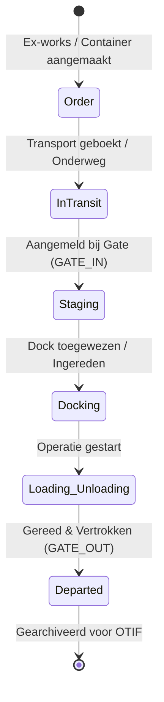

# ARCHITECTURE: ILG Foodgroup Control Tower

Dit document beschrijft de technische blauwdruk van het ILG Foodgroup YMS, ontworpen voor maximale schaalbaarheid, data-integriteit en een superieure gebruikerservaring.

## 1. Atomic Design & Mappenstructuur
We zijn afgestapt van een monolithische opzet en werken volgens een **Atomic Design** methodiek. Dit zorgt voor herbruikbaarheid en isolatie van logica:

- **`/src/components/shared` (Atoms & Molecules)**: De fundamenten van ons design system (Buttons, Modals, Badges, Inputs). Deze zijn volledig context-vrij en puur gericht op presentatie.
- **`/src/components/features` (Organisms)**: Complexere componenten die bedrijfslogica bevatten, zoals de `YmsTimeline`, `DockGrid` en `DeliveryTable`. Zij communiceren met de hooks en context.
- **`/src/components/pages` (Templates & Pages)**: De hoogste laag die features samenbrengt in functionele schermen (Dashboard, Monitor, Settings).

## 2. Logistieke State Machine
De levenscyclus van een vracht of container is strikt gedefinieerd om inconsistenties te voorkomen. Elke stap wordt bewaakt door de `@Yard-Strategist`.

## 3. Uni-directionele Dataflow
Het systeem hanteert een strikte dataflow om race-conditions te vermijden en de UI altijd in sync te houden met de server:

1. **Action**: Gebruiker initieert een actie (bijv. "Check-in truck").
2. **Socket Dispatch**: De actie wordt via `SocketContext` naar de backend gestuurd.
3. **Server Logic**: De Node.js server valideert de actie en voert SQLite transacties uit.
4. **Broadcast**: De nieuwe status wordt via WebSockets naar alle actieve cliënten gepusht.
5. **UI Update**: Alle schermen (Timeline, Dashboard, Monitor) worden simultaan bijgewerkt.

## 4. Kwaliteitsbewaking (Gatekeeping)
- **@QA-Automator**: Scant elke actie op integriteit. Geen `undefined` ritten of dubbele dock-toewijzingen.
- **@System-Architect**: Bewaakt de stabiliteit van de Socket-router en de correcte afhandeling van disconnects.
