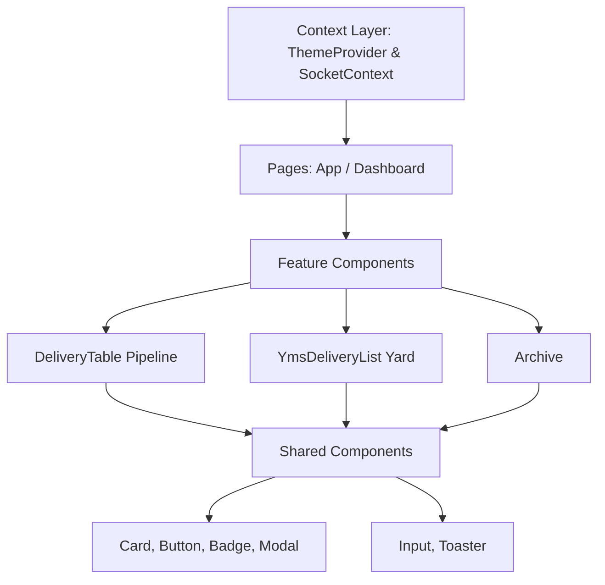

# ARCHITECTURE: ILG Foodgroup YMS

Dit document beschrijft de kern-architectuur van het vernieuwde ILG Foodgroup Yard Management Systeem, zoals beheerd door de @System-Architect en @Yard-Strategist.

## 1. Logistieke Flow (End-to-End)
De levenscyclus van een levering stroomt door drie strikte fases:

1.  **Fase 1: Global Pipeline (Inkamp)**
    *   **Ex-Works:** Orders (FCA/FOB/EXW) worden in de gaten gehouden. Zodra de `readyForPickupDate` is gepasseerd, worden deze actief getracked.
    *   **Containers:** Zodra een container op zee (ETA Port) is geregistreerd, krijgt deze een referentie-kaart in Vrachtbeheer. Wanneer de `customsStatus` overlapt naar 'Cleared' en de discharge terminal bereikt is, is de unit *ready for yard*.
2.  **Fase 2: Yard-Truck (Actief op terrein)**
    *   Zodra een driver zich meldt bij de gate (of via een automatische EDI-scan binnenkomt), promoveert de order van 'Onderweg' naar 'YMS Aankomst'.
    *   De vrachtwagen (Yard-truck) krijgt de status `GATE_IN` en stroomt door naar de `YmsDeliveryList` (Yard kaarten).
    *   Via de Quick-Assign modal krijgt de truck een `waitingAreaId` of `dockId`.
3.  **Fase 3: Archivering**
    *   Na vertrek (`GATE_OUT`) verdwijnt het object uit het actieve geheugen van de Yard Workers en verplaatst het naar het archief voor OTIF-berekening (On-Time-In-Full) en statistiek.

## 2. Component Hiërarchie (Atomic Design)
Ons UI-systeem is opgebouwd via een strikte hiërarchie om 'prop-drilling' te beperken en visuele consistentie te waarborgen.

## 3. Data Integrity & Gatekeeping
Om te voorkomen dat de database of UI in een asynchrone staat belandt, draaien we de **Gatekeeper protocollen**:
-   **Z-Index Enforcement:** De @QA-Automator dwingt af dat de `Toaster` en `Modal` gedeelde componenten altijd op absolute Z-index hoogtes (resp. `z-[9999]` en `z-[100]`) functioneren, bovenop de Feature Components.
-   **Dual-State Validation:** De @Yard-Strategist en de Socket router bewaken dat een `Ex-Works` order niet ongevraagd de Yard-status kan aannemen zonder een formele 'GATE_IN' of YMS Registratie-actie (Socket Event `YMS_SAVE_DELIVERY`).
