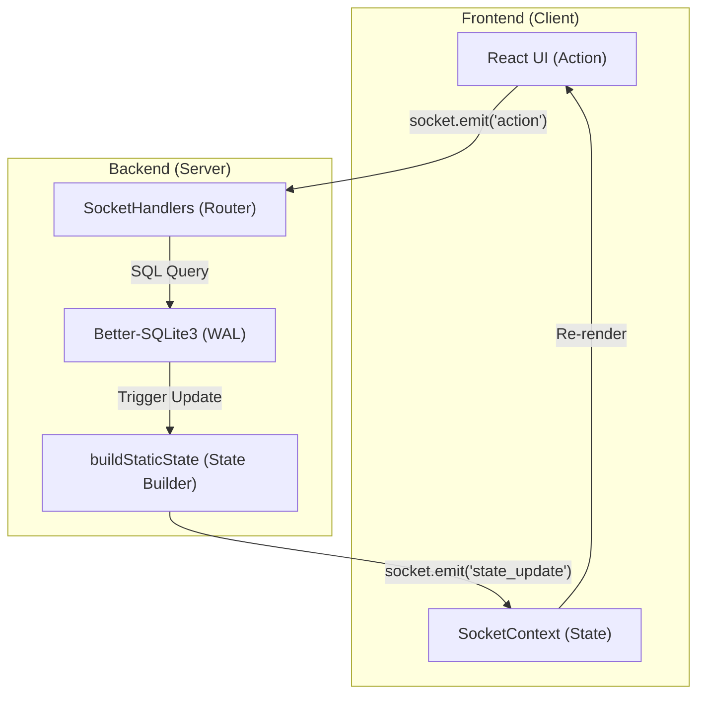
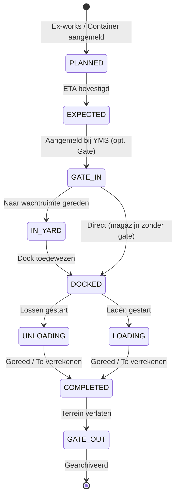

# ARCHITECTURE: ILG Foodgroup Control Tower
*Versie: v3.9.4 — Bijgewerkt: 2026-03-30 door @System-Architect*

> [!NOTE]
> Bijgewerkt na v3.9.3 E2E Stabilization: 100% E2E Operational Reliability, Socket Upsert-pattern en Layout Resilience.

Dit document beschrijft de technische blauwdruk van het ILG Foodgroup YMS, ontworpen voor maximale schaalbaarheid, data-integriteit en een superieure gebruikerservaring.

## 1. Mappenstructuur (Folder Tree)

We hanteren een strikte scheiding tussen de frontend (React) en backend (Node.js/Socket.io). De frontend volgt de **Atomic Design** principes.

```text
.
├── src/                    # Frontend (React 19)
│   ├── components/
│   │   ├── shared/         # Atoms & Molecules: Button, Modal, Badge, Card (Context-vrij)
│   │   ├── features/       # Organisms: Timeline, DockGrid, DeliveryTable (Business Logic)
│   │   ├── ui/             # UI-specifieke hulpcomponenten
│   │   └── ...             # Pagina's: YmsDashboard, Statistics, Archive, Settings
│   ├── hooks/              # Custom Hooks: useYmsData, useDeliveries, useSocket
│   ├── lib/                # Utilities: logistics.ts (validatie), utils.ts (styling)
│   ├── db/                 # Client-side DB toegang (queries.ts, sqlite.ts)
│   ├── types.ts            # Centrale TypeScript-interfaces (Single Source of Truth)
│   └── main.tsx            # React Entry point
├── server/                 # Backend (Node.js, Express, Socket.io)
│   ├── routes/             # REST API Router (authenticatie, bulk-acties)
│   ├── sockets/            # socketHandlers.ts (Centrale Action-Router)
│   ├── services/           # Services: pdfService, queueService (Logistieke algoritmes)
│   ├── db/                 # Database: Migraties, Migrator-logic
│   ├── middleware/         # Auth Middleware (JWT validatie)
│   └── scripts/            # Database Health Checks en Fix-scripts
├── database.sqlite         # Productie-data (SQLite)
├── server.ts               # Backend Entry point (Express + Socket.io Server)
└── package.json            # Afhankelijkheden en build-scripts
```

## 2. Systeem Blauwdruk (Dataflow)

Het systeem werkt op basis van een real-time, event-gedreven architectuur.



## 3. State Synchronization (Upsert Pattern)
Sinds v3.9.1 hanteert de `SocketContext` een **Upsert-patroon** voor real-time updates:
1. **`state_update`**: Volledige reconciliatie van de warehouse-state bij verbinding of selectie.
2. **`state_patch`**: Delta-updates voor bestaande records.
3. **`state_upsert`**: Indien een patch een onbekend ID bevat (bijv. een nieuwe test-levering), wordt deze direct toegevoegd aan de lokale cache. Dit voorkomt 'ghost data' tijdens snelle E2E-sequenties.

## 4. Logistieke Levenscyclus (State Machine)

De levenscyclus van een vracht is cruciaal voor de **Smart Call Logic** en dashboard-filtering:



## 4. Uni-directionele Dataflow (Kern-Architectuur)

Het systeem hanteert een strikte flow om race-conditions te vermijden:

1.  **UI Action**: Gebruiker klikt op een knop (bijv. "Lossen").
2.  **Socket Emit**: De client stuurt een event naar de server met de API-token.
3.  **Server Validatie**: De server valideert de rechten en de huidige status.
4.  **Database Write**: De wijziging wordt persistent gemaakt in SQLite (WAL mode).
5.  **State Broadcast**: De server bouwt de *nieuwe statische state* op en verstuurt deze naar alle aangesloten clients in dat magazijn.
6.  **React Sync**: De client update zijn lokale cache en triggert een re-render.

## 5. Database Architectuur (SQLite via better-sqlite3)

### Tabelstructuur — Kern (Global Pipeline)
```
users          (id PK, name, email, passwordHash, role, permissions JSON)
deliveries     (id PK, type, reference, billOfLading, supplierId, status, eta, ...)
documents      (id PK, deliveryId FK, name, status, required)
address_book   (id PK, type, name, contact, email, ...)
logs           (id PK, timestamp, user, action, details)
audit_logs     (id PK, deliveryId FK, timestamp, user, action, details)
settings       (key PK, value JSON)
```

### Tabelstructuur — YMS (Operational)
```
yms_warehouses (id PK, name, descriptor, address, hasGate)
yms_docks      (id, warehouseId — composite PK)
yms_waiting_areas (id, warehouseId — composite PK)
yms_deliveries (id PK, warehouseId, dockId, status, scheduledTime, ...)
pallet_transactions (id PK, entityId, balanceChange, createdAt)
```

## 6. Multi-Warehouse Isolatie
Isolatie wordt afgedwongen op socket-niveau: elk event wordt gefilterd op `warehouseId`. Dit voorkomt dat data van Magazijn A lekt naar Magazijn B.

## 7. Kwaliteitsbewaking (v3.7.4)
Sinds v3.7.4 is de "High-Density" mode de standaard. Dit betekent:
- Geen onnodige witruimte in tabellen.
- Informatiedichtheid geoptimaliseerd voor 4K en breedbeeld monitoren.
- Volledige theme-synchronisatie via CSS variabelen.

## 8. Beveiliging & Compliance
- **JWT**: Alle communicatie is versleuteld en geautoriseerd.
- **Audit Trail**: Elke actie is herleidbaar naar een gebruiker en timestamp.
- **Bcrypt**: Wachtwoorden worden nooit in plaintext opgeslagen.
- **RBAC Guard (v3.10.0)**: Middleware die elke socket-actie valideert tegen de permissies van de gebruiker.

## 9. E2E & Layout Resilience
Om 100% betrouwbaarheid in geautomatiseerde testen te garanderen, hanteren we de **Invisible Sidebar Rule**:
- In 'Planning Mode' wordt de sidebar niet verwijderd (`hidden`), maar verborgen via `invisible opacity-0`.
- Dit zorgt ervoor dat Playwright-locators altijd toegang hebben tot navigatie-elementen, wat timeouts voorkomt.
- Test-helpers in `helpers.ts` maken gebruik van `includeHidden: true` voor robuuste interactie.

## 10. Shell-First UI & Performance
- **Shell-First Rendering**: Sidebar en navigatie renderen onmiddellijk; content-area toont skeletons tijdens sync.
- **Null-State Resilience**: Componenten zijn bestand tegen initieel ontbrekende data via optional chaining.
