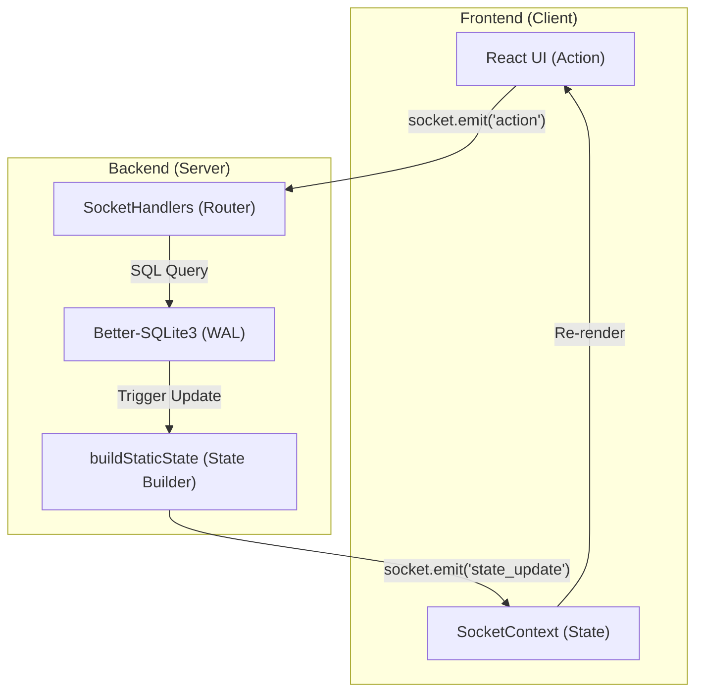
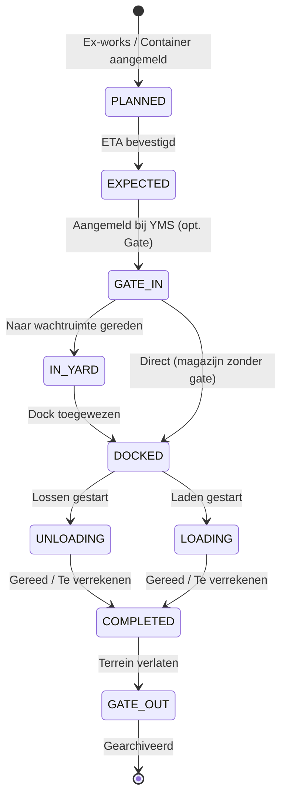

# ARCHITECTURE: ILG Foodgroup Control Tower
*Versie: v3.10.5 — Bijgewerkt: 2026-04-06 door @System-Architect*

> [!IMPORTANT]
> Dit bestand is onderdeel van de automatische versie-synchronisatie. Voer na elke wijziging in dit bestand verplicht `npm run version:sync` uit om project-brede consistentie te borgen.

> [!NOTE]
> Bijgewerkt na v3.10.2 UI & Navigation Refactor: Direct Dashboard Editing, Shared Modal Pattern en Gecentraliseerde Capaciteitsinstellingen.

Dit document beschrijft de technische blauwdruk van het ILG Foodgroup YMS, ontworpen voor maximale schaalbaarheid, data-integriteit en een superieure gebruikerservaring.

## 1. Mappenstructuur (Folder Tree)

We hanteren een strikte scheiding tussen de frontend (React) en backend (Node.js/Socket.io). De frontend volgt de **Atomic Design** principes.

```text
.
├── server/                 # Backend (Node.js, Express, Socket.io)
│   ├── db/                 # Database logica & SQLite opslag
│   │   ├── migrations/     # SQL- en TS-migratiebestanden (v3.10.x compliant)
│   │   ├── database.db     # Lokale ontwikkelingsdatabase
│   │   └── migrator.ts     # Handelt de uitvoering van migraties af
│   ├── middleware/         # Express middleware (bv. auth.ts voor JWT)
│   ├── routes/             # REST API endpoints (auth.ts, deliveries.ts)
│   ├── scripts/            # Backend onderhoud scripts (db-health, sync-version)
│   ├── services/           # Business logic (pdfService, queueService)
│   ├── sockets/            # socketHandlers.ts (Centrale real-time router)
│   └── workers/            # Achtergrondtaken (bv. inventory-worker)
├── src/                    # Frontend (React 19, Vite)
│   ├── components/
│   │   ├── features/       # Business-specifieke componenten (o.a. Timeline, PalletLedger)
│   │   ├── shared/         # Herbruikbare Atomic componenten (Button, Modal, Table)
│   │   ├── ui/             # UI-hulpcomponenten (Combobox, MilestoneStepper)
│   │   ├── AddressBook.tsx # Adresboek beheer
│   │   ├── Dashboard.tsx   # Hoofddashboard view
│   │   ├── YmsDashboard.tsx# Operationele Yard view
│   │   └── ...             # Overige (UserManagement, Settings, Statistics)
│   ├── db/                 # Client-side DB toegang (sqlite.ts, queries.ts)
│   ├── hooks/              # Custom React hooks (useDeliveries, useYmsData)
│   ├── lib/                # Utility functies en validatieregels (logistics.ts, ymsRules.ts)
│   ├── services/           # Interne frontend services
│   ├── test/               # Frontend test setup
│   ├── types.ts            # Centrale TypeScript-interfaces
│   ├── SocketContext.tsx   # Context voor real-time socket communicatie
│   ├── ThemeContext.tsx    # Context voor Dark/Light/ILG thema's
│   └── main.tsx            # App entry point
├── tests/                  # Test Suite (Playwright & Vitest)
│   ├── e2e/                # End-to-end tests (o.a. dock_occupancy, finance, rbac)
│   └── integration/        # Integratietesten voor auth en sockets
├── scripts/                # Root-level scripts (reset_db, seed_demo)
├── public/                 # Statische assets (logo's, achtergronden)
├── database.sqlite         # Hoofd SQLite database bestand
├── server.ts               # Backend Entry point
└── AGENTS.md, ARCHITECTURE.md, ROADMAPv3.md # Kern documentatie
```

## 2. Systeem Blauwdruk (Dataflow)

Het systeem werkt op basis van een real-time, event-gedreven architectuur.



## 3. State Synchronization (Upsert Pattern)
Sinds v3.9.1 hanteert de `SocketContext` een **Upsert-patroon** voor real-time updates:
1. **`state_update`**: Volledige reconciliatie van de warehouse-state bij verbinding of selectie.
2. **`state_patch`**: Delta-updates voor bestaande records.
3. **`state_upsert`**: Indien een patch een onbekend ID bevat (bijv. een nieuwe test-levering), wordt deze direct toegevoegd aan de lokale cache. Dit voorkomt 'ghost data' tijdens snelle E2E-sequenties.

## 4. Logistieke Levenscyclus (State Machine)

De levenscyclus van een vracht is cruciaal voor de **Smart Call Logic** en dashboard-filtering:



## 4. Uni-directionele Dataflow (Kern-Architectuur)

Het systeem hanteert een strikte flow om race-conditions te vermijden:

1.  **UI Action**: Gebruiker klikt op een knop (bijv. "Lossen").
2.  **Socket Emit**: De client stuurt een event naar de server met de API-token.
3.  **Server Validatie**: De server valideert de rechten en de huidige status.
4.  **Database Write**: De wijziging wordt persistent gemaakt in SQLite (WAL mode).
5.  **State Broadcast**: De server bouwt de *nieuwe statische state* op en verstuurt deze naar alle aangesloten clients in dat magazijn.
6.  **React Sync**: De client update zijn lokale cache en triggert een re-render.

## 5. Database Architectuur (SQLite via better-sqlite3)

### Tabelstructuur — Kern (v3.10.5)
```
users          (id PK, name, email, passwordHash, role, permissions JSON)
deliveries     (id PK, type, reference, billOfLading, supplierId, status, eta, requiresQA, ...)
documents      (id PK, deliveryId FK, name, status, required, blocksMilestone)
address_book   (id PK, type, name, contact, email, ...)
logs           (id PK, timestamp, user, action, details)
audit_logs     (id PK, deliveryId FK, timestamp, user, action, details)
settings       (key PK, value JSON)
```

### Tabelstructuur — YMS (Operational)
```
yms_warehouses (id PK, name, descriptor, address, hasGate)
yms_docks      (id, warehouseId — composite PK)
yms_waiting_areas (id, warehouseId — composite PK)
yms_deliveries (id PK, warehouseId, dockId, status, scheduledTime, ...)
pallet_transactions (id PK, entityId, balanceChange, createdAt)
```

## 6. Multi-Warehouse Isolatie
Isolatie## 🔐 Security & RBAC (v3.10.0)

Sinds v3.10.0 hanteert het systeem een strikt **Role-Based Access Control** (RBAC) model, zowel in de UI als op de Sockets:

| Rol | Rechten | Beperkingen |
| :--- | :--- | :--- |
| **Admin** | Volledige toegang (CRUD op alles, inclusief settings en users). | Geen. |
| **Manager** | CRUD op alle logistieke entiteiten. Kan geen configuraties wijzigen. | Geen toegang tot `YMS_SAVE_WAREHOUSE` of `YMS_SAVE_USER`. |
| **Staff** | CRUD op leveringen en YMS status updates. | Kan geen entiteiten verwijderen (Geen `DELETE`). |
| **Viewer** | Read-only toegang tot alle dashboards en tabellen. | Geen enkele `dispatch` actie toegestaan. Knoppen worden verborgen in de UI. |

### Socket Guarding
Elke socket-actie wordt gevalideerd in `server/sockets/socketHandlers.ts` middels de `checkRole` helper:
```typescript
const checkRole = (required: string) => {
  if (user.role === 'admin') return true;
  if (user.role === required) return true;
  return false;
};
```

## 7. UI & UX Patterns (v3.10.2)
- **Shared Modal Logic**: In plaats van pagina-navigatie gebruiken we de `DeliveryDetailModal` voor CRUD-acties op zowel het Dashboard als in het Vrachtbeheer.
- **Color-Coded Visuals**: De sidebar iconen zijn kleurgecodeerd per categorie (bv. Blauw voor Dashboard, Amber voor Pipeline, Groen voor Yard) voor snellere herkenning.
- **Centralized Admin**: Capaciteitsinstellingen (minutes per pallet, threshold, hasGate) staan gecentraliseerd onder `YmsSettings.tsx` (Tab: Capaciteit).

Het systeem voorkomt dubbele dock-boekingen op database-niveau en via socket-validatie:
1. **Overlap Detectie**: `(start1 < end2) && (end1 > start2)`.
2. **Duur-berekening**: `Base + (Pallets * Min/Pallet)`.
3. **Guard**: Admins kunnen conflicten overriden, Lagere rollen krijgen een `Error` bericht via de `error_message` socket event.
- Informatiedichtheid geoptimaliseerd voor 4K en breedbeeld monitoren.
- Volledige theme-synchronisatie via CSS variabelen.

## 8. Beveiliging & Compliance
- **JWT**: Alle communicatie is versleuteld en geautoriseerd.
- **Audit Trail**: Elke actie is herleidbaar naar een gebruiker en timestamp.
- **Bcrypt**: Wachtwoorden worden nooit in plaintext opgeslagen.
- **RBAC Guard (v3.10.0)**: Middleware die elke socket-actie valideert tegen de permissies van de gebruiker.

## 9. E2E & Layout Resilience
Om 100% betrouwbaarheid in geautomatiseerde testen te garanderen, hanteren we de **Invisible Sidebar Rule**:
- In 'Planning Mode' wordt de sidebar niet verwijderd (`hidden`), maar verborgen via `invisible opacity-0`.
- Dit zorgt ervoor dat Playwright-locators altijd toegang hebben tot navigatie-elementen, wat timeouts voorkomt.
- Test-helpers in `helpers.ts` maken gebruik van `includeHidden: true` voor robuuste interactie.

## 10. Shell-First UI & Performance
- **Shell-First Rendering**: Sidebar en navigatie renderen onmiddellijk; content-area toont skeletons tijdens sync.
- **Null-State Resilience**: Componenten zijn bestand tegen initieel ontbrekende data via optional chaining.
