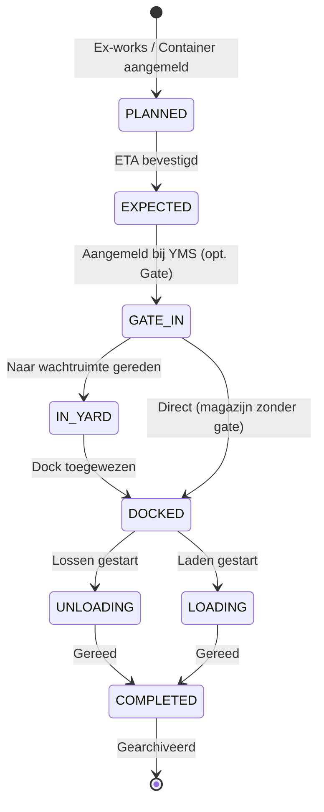

# ARCHITECTURE: ILG Foodgroup Control Tower
*Versie: v3.2.3.3 — Bijgewerkt: 2026-03-26 door @System-Architect*

Dit document beschrijft de technische blauwdruk van het ILG Foodgroup YMS, ontworpen voor maximale schaalbaarheid, data-integriteit en een superieure gebruikerservaring.

## 1. Atomic Design & Mappenstructuur

We hanteren een **Atomic Design** methodiek voor maximale herbruikbaarheid en logische isolatie:

| Laag | Pad | Inhoud |
|---|---|---|
| Atoms & Molecules | `/src/components/shared` | Button, Modal, Badge, Card — volledig context-vrij |
| Organisms | `/src/components/features` | YmsTimeline, DockGrid, DeliveryTable — bevatten bedrijfslogica |
| Templates & Pages | `/src/components/` | YmsDashboard, Settings — brengen features samen |
| Hooks | `/src/hooks/` | `useYmsData`, `useDeliveries` — isoleren state-access |

## 2. Logistieke State Machine

De levenscyclus van een vracht is strikt gedefinieerd om data-inconsistenties te voorkomen:



## 3. Uni-directionele Dataflow (Kern-Architectuur)

Het systeem hanteert een strikte uni-directionele dataflow om race-conditions en stale state te vermijden:

```
[Gebruiker] → [UI Action] → [SocketContext.dispatch()]
    → [socket.emit('action', {type, payload})]
    → [Server: socketHandlers.ts — try/catch per case]
    → [Database: queries.ts — INSERT OR REPLACE]
    → [buildStaticState(warehouseId)]
    → [io.sockets.forEach → s.emit('state_update', ...)]
    → [SocketContext setState()] → [React re-render]
```

**Kritische bevindingen (v3.2.3.3):**
- Alle `io.emit()` globale broadcasts zijn vervangen door `io.sockets.sockets.forEach()` met warehouse-filtering om data-lekkage tussen magazijnen te voorkomen.
- Backend `error_message` events zijn gekoppeld aan Sonner-toasts voor directe UI-feedback bij server-exceptions.

## 4. Database Architectuur (SQLite via better-sqlite3)

### Tabelstructuur — YMS-kern
```
yms_warehouses (id PK, name, hasGate)
yms_docks      (id, warehouseId — composite PK)
yms_waiting_areas (id, warehouseId — composite PK)
yms_deliveries (id PK, warehouseId, dockId, status, scheduledTime, ...)
```

> [!IMPORTANT]
> **v3.2.3.3 Kritieke Fix**: De `FOREIGN KEY(dockId, warehouseId) REFERENCES yms_docks` compound-constraint in `yms_deliveries` is verwijderd uit `sqlite.ts`. Deze constraint werd ongeldig na schema-wijzigingen, waardoor **elke write naar yms_deliveries** met een `foreign key mismatch`-error faalde — dit was de definitieve root cause van de onzichtbare dock-planning.

### Prepared Statements (queries.ts)
Alle SQL-operaties verlopen via **expliciete kolomnamen** in `INSERT OR REPLACE`-statements om parameter-volgorde-fouten te elimineren:
```sql
INSERT OR REPLACE INTO yms_deliveries (
  id, warehouseId, reference, licensePlate, supplier, supplierId,
  mainDeliveryId, temperature, scheduledTime, arrivalTime,
  registrationTime, isLate, dockId, ...
) VALUES (?, ?, ?, ...)
```

## 5. Multi-Warehouse State Isolatie

Elk socket-verbinding draagt een `socket.data.selectedWarehouseId`. Bij elke `buildStaticState`-aanroep wordt `getYmsDeliveries(warehouseId)` en `getYmsDocks(warehouseId)` doorgegeven zodat elke gebruiker alleen de data van zijn eigen magazijn ziet.

## 6. Optionele Gate-In Flow

Magazijnen configureren via `yms_warehouses.hasGate`:
- **hasGate = true**: `EXPECTED → GATE_IN → DOCKED` (volledige flow)
- **hasGate = false**: `PLANNED/EXPECTED → DOCKED` (direct toewijzen, geen gate-stap)

De `YMS_ASSIGN_DOCK` handler detecteert dit automatisch op basis van de huidige levering-status.

## 7. Sessiebeheer & Tablet Mode

| Rol | JWT-duur | Inactiviteits-timer |
|---|---|---|
| `admin` / `staff` | 8 uur | 60 minuten |
| `tablet` | 365 dagen | Uitgeschakeld (Always-On) |

## 8. Kwaliteitsbewaking (Release Criteria)

Zie `AGENTS.md` voor de volledige release-criteria-checklist. Kernpunten:
- ✅ Geen console-errors in de browser
- ✅ Container-kaarten tonen correcte data
- ✅ Sonner-toasts voor alle backend-fouten
- ✅ Z-index: toasts > modals > sidebar
