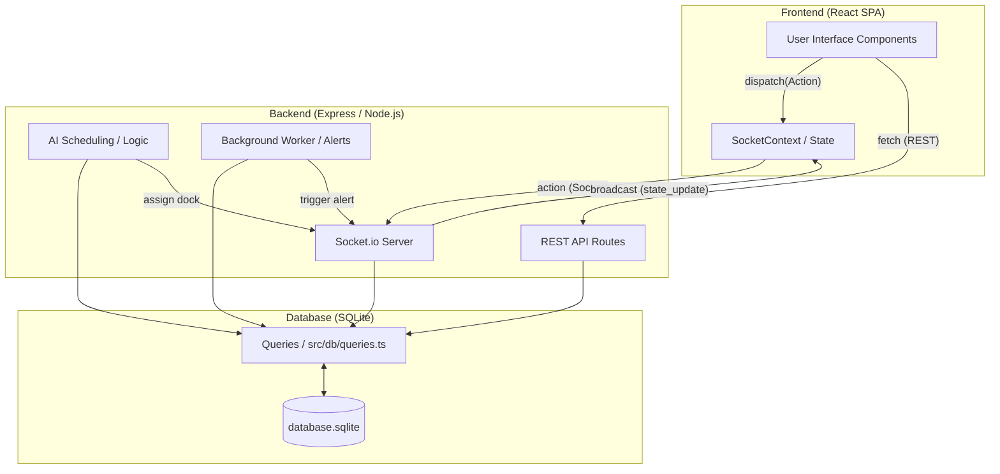

# Project Architectuur - Yard Management System (YMS)

Dit document beschrijft de technische architectuur van het YMS-project, de verschillende componenten en hoe deze met elkaar communiceren.

## Overzicht

Het systeem is een moderne webapplicatie bestaande uit een **React-frontend** en een **Node.js/Express-backend**. De applicatie maakt gebruik van real-time communicatie via **Socket.io** om alle gebruikers direct op de hoogte te stellen van wijzigingen in de status van leveringen, docks en magazijnen.

## Componenten

### 1. Frontend (Client-side)
*   **Technologie**: React (19), TypeScript, Vite.
*   **Browsing/Routing**: Single Page Application (SPA) met state-based routing in `App.tsx`.
*   **State Management**: `SocketContext.tsx` beheert de globale applicatiestatus (`AppState`) en de geauthenticeerde gebruiker. Het luistert naar `init` en `state_update` events van de server.
*   **UI Framework**: Tailwind CSS voor styling en Lucide-React voor iconen. Framer Motion wordt gebruikt voor animaties.

### 2. Backend (Node.js & Express)
De backend is modulair opgebouwd voor schaalbaarheid en onderhoudbaarheid:
- **`server.ts`**: De centrale entry point die Express, Socket.io en alle sub-modules initialiseert.
- **`/server/routes/`**: Bevat de REST API endpoints (zoals `/api/login` en `/api/deliveries`).
- **`/server/sockets/`**: Bevat de Socket.io action-handlers voor real-time updates.
- **`/server/workers/`**: Bevat background workers (zoals de `inventory-worker` voor Reefer alerts).
- **`/server/services/`**: Bevat business logica (zoals `aiService` voor risico-analyse).
- **`/src/db/`**: Bevat de SQLite database logica (`queries.ts` en `sqlite.ts`).

### 3. Database (Persistentie)
*   **Technologie**: SQLite via `better-sqlite3`.
*   **Modus**: WAL (Write-Ahead Logging) voor optimale concurrency.
*   **Schema**:
    *   `deliveries` & `yms_deliveries`: Kerngegevens van transport en yard-registraties.
    *   `yms_warehouses`, `yms_docks`, `yms_waiting_areas`: De fysieke layout.
    *   `users`: Gebruikersbeheer en rollen.
    *   `address_book`: Relaties met leveranciers en vervoerders.
    *   `logs` & `audit_logs`: Systeem- en entiteit-specifieke activiteit.

## Datastroom & Communicatie

Het systeem volgt een uni-directionele datastroom voor statusupdates:

1.  **Gebruiker voert actie uit** (bijv. Truck aanmelden).
2.  Frontend roept `dispatch(type, payload)` aan via de `SocketContext`.
3.  Server ontvangt het `action` event.
4.  Server valideert de actie, voert database-queries uit en berekent eventuele bijwerkingen (zoals KPI updates).
5.  Server broadcast een `state_update` (of `DELIVERY_UPDATED`) naar **alle** verbonden clients.
6.  Frontends ontvangen de update en renderen de UI opnieuw met de nieuwste data.

### Mermaid Diagram

## Beveiliging
*   **Authenticatie**: JWT (JSON Web Tokens) opgeslagen in localStorage.
*   **Autorisatie**: Role-based access control (Admin, Staff, Manager, Viewer).
*   **Hashing**: Wachtwoorden worden gehashed met `bcryptjs`.
