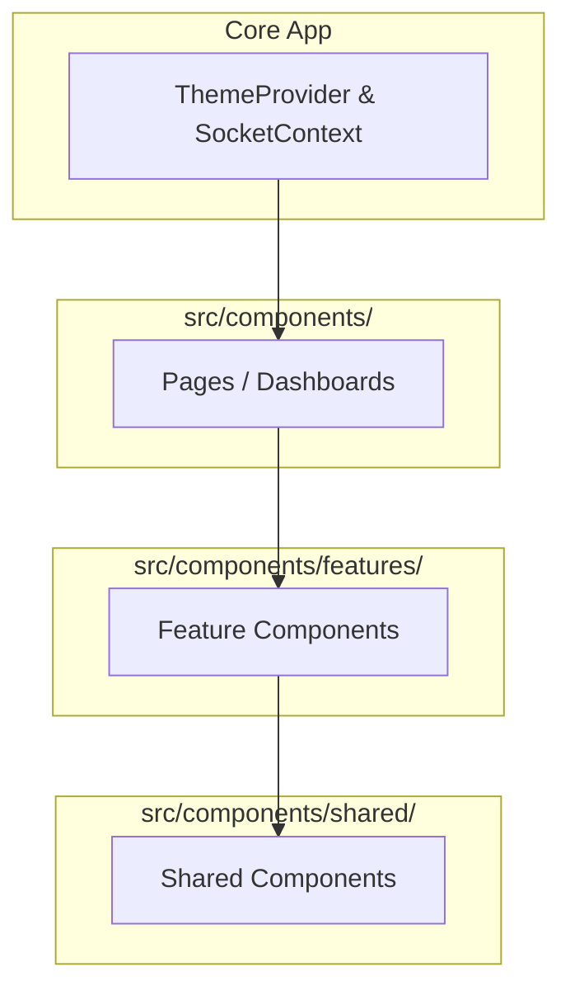

# Project Architectuur - Yard Management System (YMS)

Dit document beschrijft de technische architectuur van het YMS-project na de succesvolle modularisatie en refactoring.

## 1. Project Map (Folder Tree)

```text
/root/yms-project/
├── server/                 # Backend Node.js/Express
│   ├── routes/             # RESTful API endpoints (voornamelijk fallback & auth)
│   ├── services/           # Gedeelde business logica server-side
│   ├── sockets/            # Socket.io actie-handlers (Gecentraliseerde data-brug)
│   └── workers/            # Achtergrond processen (zoals inventory-worker)
├── src/                    # Frontend React/Vite
│   ├── components/         # Atomic Design UI structuur
│   │   ├── features/       # Samengestelde bedrijfslogica componenten (Cards, Tables, Timelines)
│   │   ├── shared/         # Herbruikbare, 'dumb' thema-componenten (Button, Input, Badge, Modal)
│   │   └── (pages)         # Hoofdpagina's geassembleerd uit features (YmsDashboard, Settings, e.d.)
│   ├── db/                 # Database laag & SQLite initialisatie
│   ├── hooks/              # Data-fetching en socket logica (useYmsData, useDeliveries)
│   ├── lib/                # Utility functies en validaties (clsx, ymsRules)
│   ├── App.tsx             # Hoofd React entry point (Routing, Auth)
│   ├── ThemeContext.tsx    # Beheert overkoepelend Dark/Light modus
│   └── SocketContext.tsx   # Globale WebSocket state en dispatcher
└── database.sqlite         # SQLite database in WAL-modus
```

## 2. Atomic Design Hiërarchie



## 3. Data Flow
De uni-directionele stroom garandeert consistentie en maakt de frontend predictabel:
1. **Actie (Frontend)**: Een gebeurtenis in een feature component roept een abstracte functie uit een Hook aan (bijv. `deliveryActions.assignDock()`).
2. **Dispatch (SocketContext)**: De Hook vuurt een Socket.io event af naar de backend met een gedefinieerde `action` (bijv. `YMS_SAVE_DOCK`) en een payload.
3. **Afhandeling (Backend)**: De `socketHandlers.ts` valideert de permissies (Admin / Staff), registreert dit direct in de Audit Log, en voert gecachete database operations uit.
4. **Broadcast**: De backend pusht via `io.emit("state_update")` een nieuw, volledig statussnapshot naar alle verbonden clients.
5. **Render (Frontend)**: De `SocketContext` update de reactieve locale state. De afhankelijke Hooks vangen dit op, en de `pages` en `features` schieten de zuivere data door naar de 'dumb' `shared` componenten voor de uiteindelijke visuele (re)render.

## 4. Database Laag (SQLite & Optimalisaties)
De data persistence laag is ontworpen rond `better-sqlite3` en steunt op diverse optimalisaties voor maximale betrouwbaarheid in netwerkomgevingen:

- **Prepared Statements**: Alle queries in `src/db/queries.ts` worden bij het opstarten eenmalig gecompileerd en permanent in het geheugen opgeslagen (`stmts` cache). Dit versnelt iteraties drastisch, elimineert N+1 problemen en sluit SQL-injectie gegarandeerd uit.
- **Indices & Relaties**: Om de complexe query's (die over dashboards verspreid worden) sub-milliseconde snel te houden, worden foreign keys strikt afgedwongen en indices (zoals op `status`, `warehouseId`, en datumvelden) pro-actief opgebouwd.
- **WAL Modus**: De database functioneert in Write-Ahead Logging modus. Dit stelt de Socket-server in staat om gelijktijdige en ononderbroken asynchrone lees- en schrijfacties uit te voeren zonder database locks.
- **Period Overrides Logica**: Periodieke overschrijvingen op Docks (aangepaste capaciteit en tijdelijke blokkades) verlopen asynchroon via de `yms_dock_overrides` tabel. Deze logica ligt los van de statische locaties; de backend fuseert actieve overrides over conventionele docks in-memory voordat de "state" naar de frontend vloeit. Hierdoor hoeven master-tabellen niet iteratief te worden overschreven voor tijdelijke gebeurtenissen.
