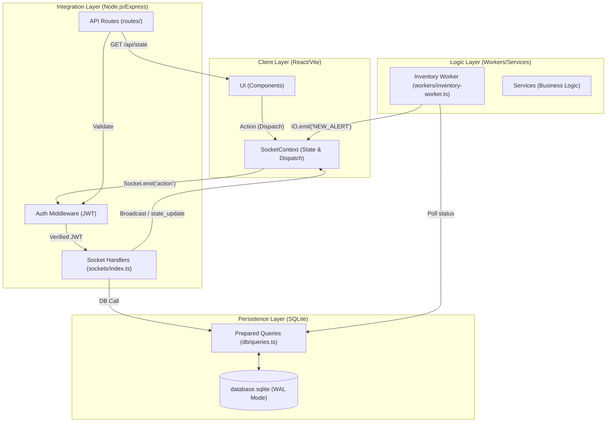

# Project Architectuur - Yard Management System (YMS)

Dit document beschrijft de technische architectuur van het YMS-project na de succesvolle modularisatie en het verwijderen van AI-componenten.

## Overzicht

Het systeem is een moderne webapplicatie bestaande uit een **React-frontend** en een **Node.js/Express-backend**. De architectuur is ontworpen voor maximale stabiliteit en real-time inzicht in een handmatig beheerde logistieke omgeving.

## Componenten & Mappenstructuur

### 1. Frontend (Client-side)
*   **Locatie**: `src/`
*   **Technologie**: React 19, Vite, Tailwind CSS, Framer Motion.
*   **State**: `SocketContext.tsx` fungeert als de "Single Source of Truth", gesynchroniseerd via Socket.io.

### 2. Backend (Server-side)
De server is opgedeeld in gespecialiseerde modules:
- **`/server/routes/`**: RESTful API endpoints voor authenticatie en data-export.
- **`/server/sockets/`**: Real-time action handlers (de "Command" zijde van de applicatie).
- **`/server/workers/`**: Autonome achtergrondtaken (zoals Reefer monitoring) die status-alerts genereren.
- **`/server/services/`**: Gedeelde business logica die door zowel routes als sockets wordt gebruikt.

### 3. Data Layer
*   **Locatie**: `src/db/`
*   **Database**: SQLite (`better-sqlite3`) in WAL-modus.
*   **Toegang**: `queries.ts` bevat alle SQL-voorbereide statements.

### YMS Modulaire Architectuur (Verified)

Dit document beschrijft de daadwerkelijke structuur van het Yard Management Systeem na de modulaire refactoring en de verwijdering van AI-componenten.

## Systeem Overzicht

Het systeem is gebouwd op een uni-directionele datastroom over Sockets, ondersteund door een modulaire Express-backend en een SQLite database met Prepared Statements.

### Architectuur Diagram

## Onderdelen

### 1. Client Layer
- **SocketContext.tsx**: Beheert de wereldwijde state, de JWT-verificatie in de handshake en faciliteert de `dispatch` functie om acties naar de server te sturen.
- **YmsDashboard.tsx**: De interactieve UI die reageert op state-updates van de server.

### 2. Integration Layer
- **Socket Handlers**: Gecentraliseerd in `server/sockets/`. Luistert naar acties, valideert gebruikersrollen en voert database-operaties uit.
- **Auth Middleware**: Valideert JWT-tokens voor zowel API-aanvragen als Socket-handshakes.

### 3. Logic Layer
- **Inventory Worker**: Een robuuste achtergrondprocess die elke minuut de database scant op kritieke statussen (bijv. Reefer dwell time, Wait time) en alerts genereert zonder AI-interventie.

### 4. Persistence Layer
- **Queries.ts**: Gebruikt een gecentraliseerde cache van Prepared Statements (`stmts`) om N+1 query-problemen te voorkomen en SQL-injectie uit te sluiten.
- **SQLite**: Draait in WAL (Write-Ahead Logging) modus voor gelijktijdige lees- en schrijfacties zonder blokkades.

## Belangrijke Kenmerken (Post-AI)
1.  **Voorspelbaarheid**: Geen automatische verschuivingen in de planning; de gebruiker heeft volledige controle.
2.  **Prestaties**: Door AI-berekeningen te verwijderen is de server-load aanzienlijk verminderd.
3.  **Real-time Alerts**: De `inventory-worker` bewaakt nu alleen harde limieten (zoals dwell-time), wat meer transparantie geeft.
