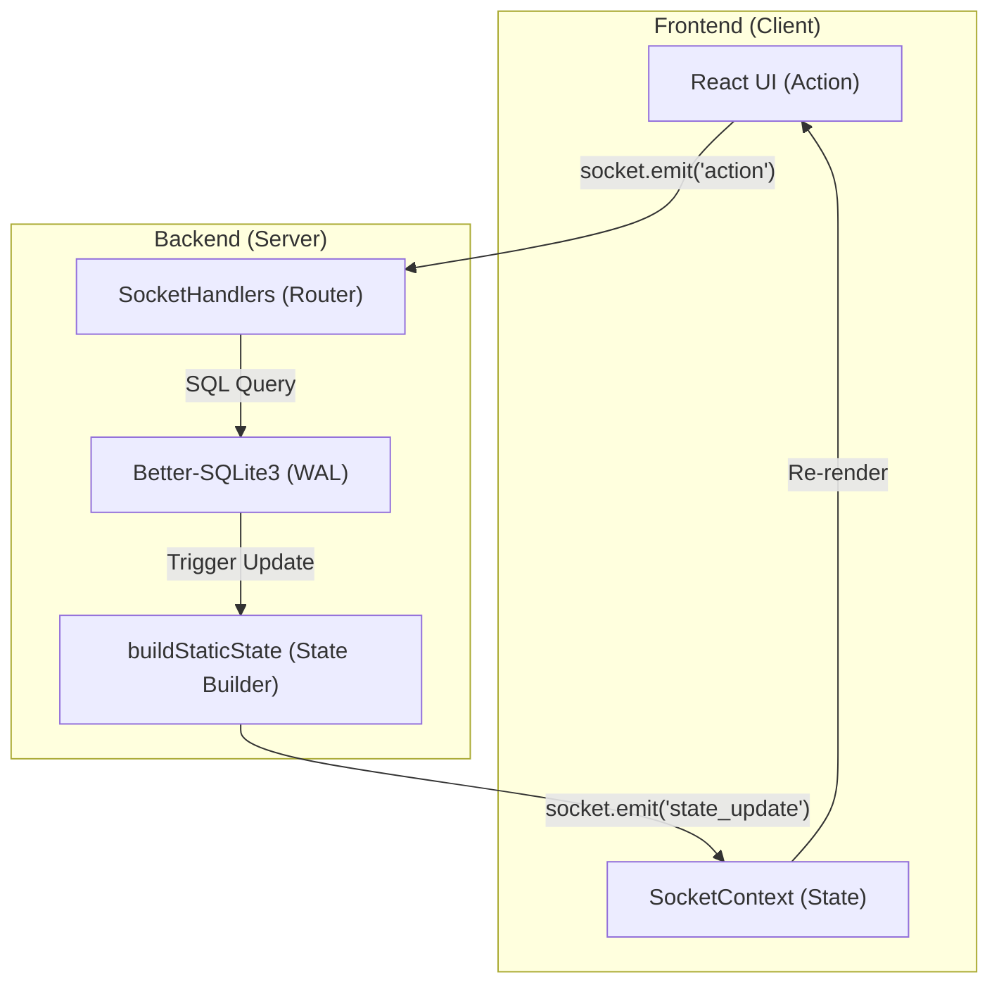
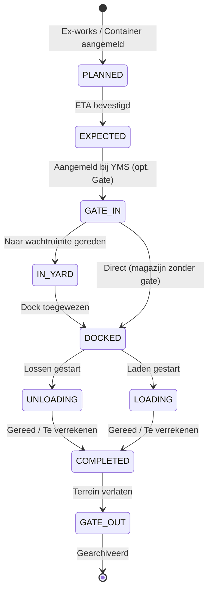

# ARCHITECTUUR: ILG Foodgroup Control Tower
*Versie: v3.7.5 — Bijgewerkt: 2026-03-29 door @System-Architect*

> [!NOTE]
> Bijgewerkt na v3.7.5 release: High-Density Table layouts, Multi-Theme Synchronization en volledige Type-Safety audit.

Dit document beschrijft de technische blauwdruk van het ILG Foodgroup YMS, ontworpen voor maximale schaalbaarheid, data-integriteit en een superieure gebruikerservaring.

## 1. Mappenstructuur (Folder Tree)

We hanteren een strikte scheiding tussen de frontend (React) en backend (Node.js/Socket.io). De frontend volgt de **Atomic Design** principes.

```text
.
├── src/                    # Frontend (React 19)
│   ├── components/
│   │   ├── shared/         # Atoms & Molecules: Button, Modal, Badge, Card (Context-vrij)
│   │   ├── features/       # Organisms: Timeline, DockGrid, DeliveryTable (Business Logic)
│   │   ├── ui/             # UI-specifieke hulpcomponenten
│   │   └── ...             # Pagina's: YmsDashboard, Statistics, Archive, Settings
│   ├── hooks/              # Custom Hooks: useYmsData, useDeliveries, useSocket
│   ├── lib/                # Utilities: logistics.ts (validatie), utils.ts (styling)
│   ├── db/                 # Client-side DB toegang (queries.ts, sqlite.ts)
│   ├── types.ts            # Centrale TypeScript-interfaces (Single Source of Truth)
│   └── main.tsx            # React Entry point
├── server/                 # Backend (Node.js, Express, Socket.io)
│   ├── routes/             # REST API Router (authenticatie, bulk-acties)
│   ├── sockets/            # socketHandlers.ts (Centrale Action-Router)
│   ├── services/           # Services: pdfService, queueService (Logistieke algoritmes)
│   ├── db/                 # Database: Migraties, Migrator-logic
│   ├── middleware/         # Auth Middleware (JWT validatie)
│   └── scripts/            # Database Health Checks en Fix-scripts
├── database.sqlite         # Productie-data (SQLite)
├── server.ts               # Backend Entry point (Express + Socket.io Server)
└── package.json            # Afhankelijkheden en build-scripts
```

## 2. Systeem Blauwdruk (Dataflow)

Het systeem werkt op basis van een real-time, event-gedreven architectuur.



## 3. Logistieke Levenscyclus (State Machine)

De levenscyclus van een vracht is cruciaal voor de **Smart Call Logic** en dashboard-filtering:



## 4. Uni-directionele Dataflow (Kern-Architectuur)

Het systeem hanteert een strikte flow om race-conditions te vermijden:

1.  **UI Action**: Gebruiker klikt op een knop (bijv. "Lossen").
2.  **Socket Emit**: De client stuurt en event naar de server met de API-token.
3.  **Server Validatie**: De server valideert de rechten en de huidige status.
4.  **Database Write**: De wijziging wordt persistent gemaakt in SQLite (WAL mode).
5.  **State Broadcast**: De server bouwt de *nieuwe statische state* op en verstuurt deze naar alle aangesloten clients in dat magazijn.
6.  **React Sync**: De client update zijn lokale cache en triggert een re-render.

## 5. Database Architectuur (SQLite)

### Tabelstructuur — Kern (Global Pipeline)
*   **users**: Beheert authenticatie, rollen en permissies (v3.10.0 RBAC).
*   **deliveries**: De "Hearth" van de pipeline. Bevat alle metadata voor containers en ex-works.
*   **documents**: Status van verplichte documentatie (SWB, NOA, etc.).
*   **audit_logs**: Chronologisch verslag van elke mutatie per zending.

### Tabelstructuur — YMS (Operational)
*   **yms_warehouses**: Magazijn configuratie (met/zonder gate, openingstijden).
*   **yms_docks**: Dock-beschikbaarheid, temperatuur-geschiktheid en bezettingsgraad.
*   **yms_deliveries**: Real-time yard status, inclusief `scheduledTime` en `statusTimestamps`.
*   **pallet_transactions**: Transactie-log voor pallet-ruil (v3.8.0 Ledger).

## 6. Multi-Warehouse Isolatie
Isolatie wordt afgedwongen op socket-niveau: elk event wordt gefilterd op `warehouseId`. Dit voorkomt dat data van Magazijn A lekt naar Magazijn B.

## 7. Kwaliteitsbewaking (v3.7.5)
- **High-Density**: Informatiedichtheid geoptimaliseerd voor breedbeeld monitoren.
- **Type-Safety**: 100% lint-free codebase (`tsc --noEmit`).
- **Theme-Sync**: Volledige thema-synchronisatie via CSS variabelen.

## 8. Beveiliging & Compliance
- **JWT**: Alle communicatie is versleuteld en geautoriseerd.
- **Audit Trail**: Elke actie is herleidbaar naar een gebruiker en timestamp.
- **RBAC Guard (v3.10.0)**: Middleware die elke socket-actie valideert.
